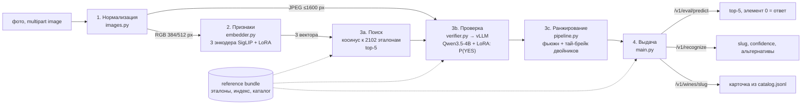

# Архитектура

Задача: по фото бутылки вернуть `slug` карточки каталога кейса (2103 вина). Решение — двухступенчатое:
быстрый поиск по эмбеддингам сужает каталог до 5 кандидатов, дообученная VLM проверяет каждого кандидата
попарно «фото ↔ эталон».

## Процессы и развёртывание

| процесс | что внутри | ресурсы (A100-80) |
|---|---|---|
| `vllm` (`scripts/run_vllm.sh`) | Qwen3.5-4B: имя `base` — без адаптера (тай-брейк), `sft` — с LoRA верификатора. OpenAI-совместимый HTTP | ~25 ГБ при `--gpu-memory-utilization 0.3` |
| `api` (`scripts/run_api.sh`) | FastAPI, 3 энкодера, индекс в памяти, кэш эталонов для верификатора | ~3 ГБ VRAM, ~1–2 ГБ RAM (кэш эталонов) |

Процессы общаются по HTTP (`WS_VLLM_URL`), поэтому их можно разнести на разные GPU/машины. vLLM держится
отдельным процессом (и отдельным Python-окружением): у него свои жёсткие версии torch/CUDA.

## Слои

### 1. Нормализация фото — `wine_scanner/images.py`
- Вход: байты файла из multipart-поля `image`.
- Проверки: пусто → 400; > 25 МБ или > 64 Мп → 413; не JPEG/PNG/WebP/BMP/TIFF(/HEIC) → 415; не декодируется,
  «бомба декомпрессии» → 422.
- Приведение: поворот по EXIF (фото с телефона), прозрачность → белый фон, RGB.
- Выход — две версии одного кадра: (а) для энкодеров — квадрат 384/512 px без сохранения пропорций, нормировка
  [-1, 1] (так обучались адаптеры); (б) для верификатора — JPEG q90, длинная сторона ≤ 1600 px (адаптер
  обучен на ~1 Мп, мелкий текст сладости/сорта должен читаться).
- Эталоны нормализуются тем же кодом один раз при старте (кэш `WS_WARM_REFS`, ~35 с на 2102 фото):
  перекодирование 5 эталонов на каждый запрос стоило бы ~0.45 с.

### 2. Извлечение признаков — `wine_scanner/embedder.py`
- Три энкодера (ансамбль даёт +2–3 п.п. к одиночному):
  `siglip-so400m-patch14-384` (v1), `siglip2-so400m-patch16-384` (v2), `siglip2-so400m-patch16-512` (v3).
- К каждому применён LoRA-адаптер (`adapters/embed_v*`, по 4 МБ), при загрузке вливается в веса
  (`merge_and_unload`), bf16. Выход — вектор 1152, L2-нормированный.
- Версии базовых моделей закреплены по commit hash в `models.lock.json`.
- ~0.2 с на фото на A100 (три прохода). Энкодеры защищены одним lock — запросы к GPU последовательны.

### 3. Поиск по каталогу — `wine_scanner/pipeline.py`, `bundle.py`, `verifier.py`
**3a. Поиск кандидатов.** Косинус запроса к векторам всех эталонов (`index_v*.npz`), среднее по трём
энкодерам, top-5. Точный перебор (2102 × 1152 — доли миллисекунды), ANN-индекс не нужен.
Верное вино попадает в top-5 в 98% случаев, на первое место — в 85%.

**3b. Проверка кандидатов.** Для каждого из 5 кандидатов — запрос к vLLM (`sft`): «IMAGE_1 — эталон,
IMAGE_2 — фото покупателя, это тот же товар? YES/NO», `max_tokens=1`, из logprobs берётся
P(YES) = P(yes)/(P(yes)+P(no)). 5 запросов параллельно, ~0.45 с суммарно (prefix caching в vLLM).
Промпт в `verifier.py` совпадает с обучающим — менять только вместе с переобучением.

**3c. Ранжирование.** Итоговый балл `0.25·(cos − cos_max)/0.05 + P(YES)`: верификатор решает, эмбеддинги
разводят почти равные ответы. Если у победителя есть «двойники» — карточки с побайтно одинаковым эталонным
фото (`twins.json`, 85 групп в каталоге) — картинкой их не различить; та же Qwen3.5-4B без адаптера
(`base`) читает этикетку и выбирает среди их текстовых описаний (`card_info.json`).

Результат слоя — упорядоченный список кандидатов, первый — ответ, плюс `confidence` = P(YES) ответа.

### 4. Выдача карточки — `wine_scanner/main.py`
- `POST /v1/eval/predict` — формат кейсодержателя: список top-5 `{"slug","score","p_yes","cosine"}`,
  элемент `[0]` — ответ (скрипт кейса берёт `.[0].slug`).
- `POST /v1/recognize` — контракт фронтенда: `status: "matched"` (по условию кейса все вина из каталога,
  ответ есть всегда), `slug`, `confidence`, `low_confidence` (< 0.3), `alternatives` — эквивалентные карточки
  того же вина (`equivalence.json`), `top_k`, `timings_ms`.
- `GET /v1/wines/{slug}` — карточка из `catalog.jsonl`: поля один в один с контрактом фронтенда,
  ссылки только `http(s)`.
- `GET /health/ready` — 200 только когда загружены модели, прогрет кэш эталонов и vLLM отвечает.
- Заголовки времени: `X-Process-Time-Ms` — обработка после получения файла (декодирование + конвейер),
  `X-Request-Time-Ms` — весь запрос, включая приём файла; оба пишутся в лог для каждого запроса `/v1/*`.

### 5. Дополнительный функционал
- **Уверенность и альтернативы**: `confidence`, `low_confidence`, `alternatives`, отрыв от второго (`margin`).
- **Деградация вместо отказа**: если vLLM недоступен или не уложился в `WS_VERIFIER_TIMEOUT`, ответ строится
  по эмбеддингам (`degraded: true`) — slug возвращается всегда.
- **Версионирование данных**: набор эталонов с `manifest.json` (sha256 каждого файла, ревизии энкодеров),
  проверяется при старте; обновление эталонов — `scripts/build_index.py`, пересчитываются только
  изменившиеся фото, код не трогается.
- **Оценка**: `eval/run_check.sh` — прогон скрипта кейсодержателя и сводка по каждому фото (ответ, время);
  `scripts/evaluate.py` — точность на размеченной папке `<slug>/<фото>`.
- Не входит в сервис (прототип есть в исследовательском репозитории): подбор аналогов для вин не из каталога
  — чтение этикетки + фильтр по цвету/типу + ранжирование по сладости/сорту/региону.

## Данные и артефакты

| артефакт | версия | хранение |
|---|---|---|
| базовые модели | commit hash в `models.lock.json` | Hugging Face, скачиваются `scripts/download_models.py` |
| LoRA энкодеров | в git | `adapters/` |
| LoRA верификатора | `q35_4b_hr_v2_sft_lora_s500` | вне git, `artifacts/verifier_lora` (приватный HF) |
| набор эталонов | `manifest.json → version` (сейчас v4) | вне git, `artifacts/reference_bundle` (приватный HF) |

Индекс неотделим от эталонов (векторы посчитаны по этим фото, верификатору нужны сами фото) — поэтому они
хранятся и версионируются одним набором.

## Как получены модели (кратко; код обучения — вне этого репозитория)
- **Энкодеры**: LoRA поверх SigLIP/SigLIP2, supervised contrastive loss по slug, с явными «трудными
  негативами» — визуально близкими винами одной линейки в одном батче; данные — фото из поиска по
  картинкам, отфильтрованные VLM и дедуплицированные с тестом по хешу.
- **Верификатор**: SFT LoRA Qwen3.5-4B на парах (эталон, фото) → YES/NO; негативы — соседние кандидаты
  top-5 (та же линейка, другая сладость/сорт); фото ~1 Мп.

## Производительность (A100, последовательные запросы)

| этап | время |
|---|---:|
| приём и декодирование фото 1.2 МБ | ~0.3 с |
| 3 энкодера + поиск | ~0.2 с |
| верификатор (5 параллельных запросов) | ~0.45 с |
| итого на сервере | ~0.7–1.0 с (p90 ~1.5 с) |

Первые запросы после старта медленнее (прогрев CUDA-ядер); `/health/ready` возвращает 200 только после
загрузки и прогрева кэша эталонов.

## Ограничения
См. раздел «Ограничения» в README.
